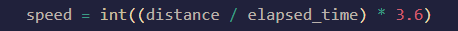

```speed = distance / time```</br>
If we can calculate distance between two points and measure the time taken by a vehicle to reach one point to another point, then we can use the above formula to calculate speed and estimate the velocity of an vehicle.

We actually did exactly as mentioned above. Draw two lines, somehow know the distance between the lines (by calculating the pixels and pass the number through some formula or by actually measure the distance manually or use your own way to calculate the distance) and record the time to reach the vehicle from one point to another point. 
<p align="center"></p>

Backbone of this code is 
* [yolov4-deepsort](https://github.com/theAIGuysCode/yolov4-deepsort)

### Pip
(TensorFlow 2 packages require a pip version >19.0.)
```bash
pip install -r requirements.txt
```

### Nvidia Driver (For GPU, if you are not using Conda Environment and haven't set up CUDA yet)
Make sure to use CUDA Toolkit version 10.1 as it is the proper version for the TensorFlow version used in this repository.
https://developer.nvidia.com/cuda-10.1-download-archive-update2

## Downloading Official YOLOv4 Pre-trained Weights
Our object tracker uses YOLOv4 to make the object detections, which deep sort then uses to track. There exists an official pre-trained YOLOv4 object detector model that is able to detect 80 classes. For easy demo purposes we will use the pre-trained weights for our tracker.
Download pre-trained yolov4.weights file: https://drive.google.com/open?id=1cewMfusmPjYWbrnuJRuKhPMwRe_b9PaT

Copy and paste yolov4.weights from your downloads folder into the 'data' folder of this repository.

## Running the Tracker with YOLOv4
To implement the object tracking using YOLOv4, first we convert the .weights into the corresponding TensorFlow model which will be saved to a checkpoints folder. Then all we need to do is run the object_tracker.py script to run our object tracker with YOLOv4, DeepSort and TensorFlow.
```bash
# Convert darknet weights to tensorflow model
python save_model.py --model yolov4 

# Run yolov4 deep sort object tracker on video
python object_tracker.py --video ./data/video/cars.mp4 --output ./outputs/cars.mp4 --model yolov4
```
The output flag allows you to save the resulting video of the object tracker running so that you can view it again later. Video will be saved to the path that you set. (outputs folder is where it will be if you run the above command!)

## Resulting Video
As mentioned above, the resulting video will save to wherever you set the ``--output`` command line flag path to. I always set it to save to the 'outputs' folder. You can also change the type of video saved by adjusting the ``--output_format`` flag, by default it is set to AVI codec which is XVID.

